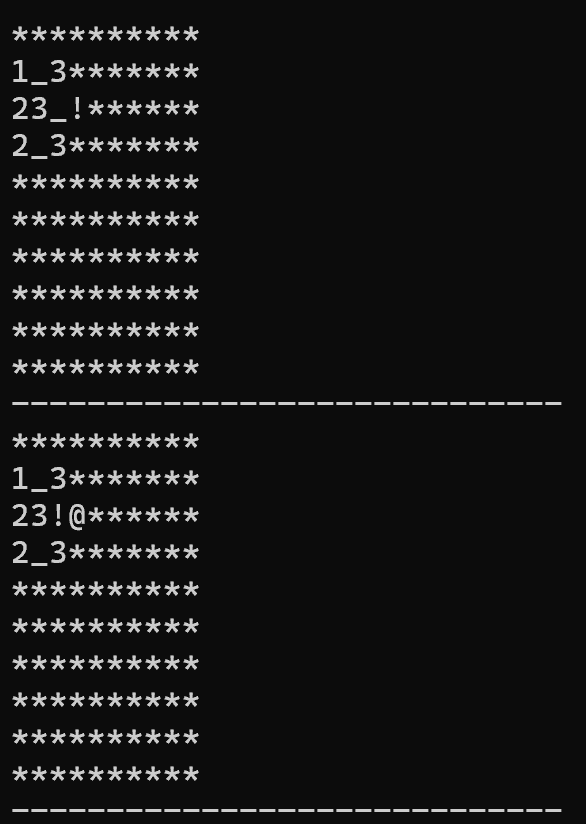

## research

A new project I decided to take on after seeeing [Veritasium’s video](https://youtu.be/w5ebcowAJD8?feature=shared) on it. I think the whole system of the QR (Quick Response) code is fascinating, and even more so when I found out the range of applications it has. 

A Reddit deep dive introduced me to [this user](https://www.reddit.com/r/programming/comments/15ab4ct/my_qr_code_snake_game_is_now_only_101_bytes/) who created the Snake game in only 101 bytes.

From my deep dive, I discovered two new Subreddits to browse: [r/tinycode](https://www.reddit.com/r/tinycode/) and [r/creativecoding](https://www.reddit.com/r/creativecoding/).

Helpful resources:

- https://www.youtube.com/watch?v=TbUWX31X4YA
- https://www.youtube.com/watch?v=ExwqNreocpg
- https://github.com/vietanhdev/minesweeper-in-c/blob/master/minesweeper.c

Games that are lightweight enough to fit in QR codes were mainly 90’s games written in Assembly D: However, thanks to great advancements in technology, I can write mine in C, and just be smart about the way I compile and compress my code.

I will be using a method called executable packing to compress my code even further, while preserving the ability of users to play the game directly without unzipping any files. I’ll use the [crinkler](https://github.com/runestubbe/Crinkler) program, which swaps out for the linker in our compile chain. We can actually use the Unix command line to create our qr code! We can use the following command. Finally, to read QR codes on your laptop, we can use zbar to decode.

## game development

I’m going to go with making Minesweeper, one of my absolute favorite ‘90’s games. I’m going to simplify the features as much as possible, using text-based graphics and simplified game features.

- No timer
- ASCII art
- one difficulty level, with 25% of the board to have bombs
    - google’s minesweeper medium level has 20% bombs. i’ll stick with a similar ratio for my game
- 10x10 board, 20 bombs
- ASCII code:
    - X: hit a bomb
    - [ * ]: uncharted land
    - [@] flagged land
    - [__]: empty land (no bomb)
    - [!]: cursor
- user will navigate the land with the arrow keys. type D to dig, and type F to flag the selected location
- once a result has been determined, we’ll have a ‘you lose’ or ‘you win’ message at the bottom of the board.
- the first move will extinguish 5 blocks: the selected block plus the immediate top, right, bottom, and left blocks

## coding

It’s been a while since I wrote properly in C, but this was a good refresher. The main method holds a current user position in the form of int x- and y- coordinates. i have an init_game, print_game, and handle_input method of all use cases. In total, my code is just under 100 lines of code. 

here’s how I compile: 

```python
gcc -o game game.c → produces game.exe
```

to execute: 

```python
game.exe
```

## compressing

When I first compiled and checked the size of the executable, it was a staggering 120,000 bytes (yikes), much larger than the 3,000 byte limit. using strip

```python
strip game.exe
```

was better, reducing it to 44,000 bytes. but still too much. my hidden weapon of Crinkler could maybe slim it down some more. 

My system was being weird, it was using x64 compiler when I should be using x86. Since I need x86 to run Crinkler, I have to put my progress on pause until I can successfully get Crinkler to further compress my game.
